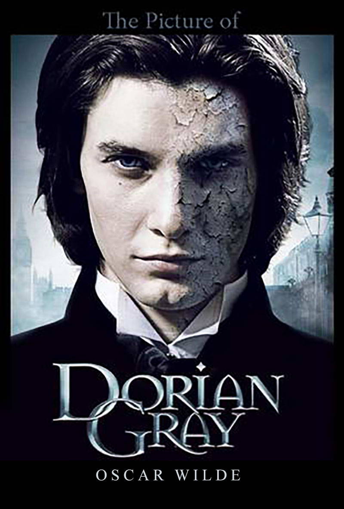
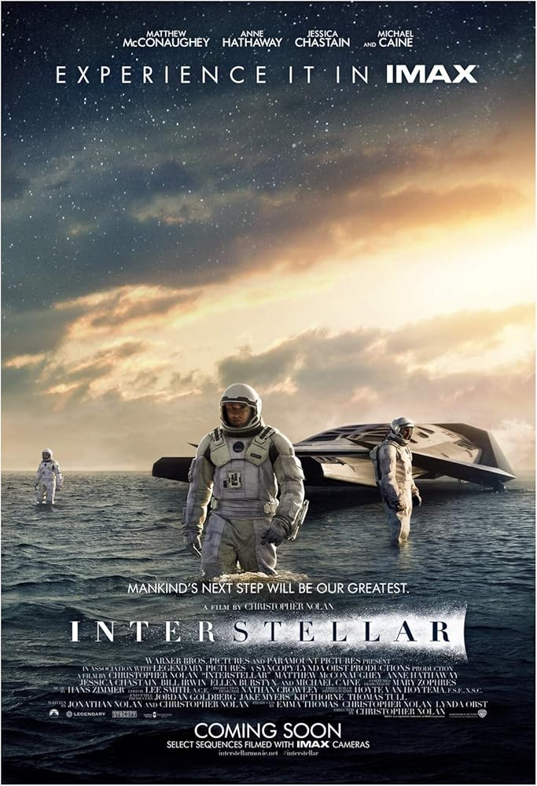

# Capstone Project: Generative AI Media Cover Reimagining

## Project Objective
The goal of this project was to take three iconic pieces of media—an audio album, a book, and a movie—and use a self-hosted Generative AI pipeline to create alternative cover variations.

---

## 1. Audio Album: Metallica - *Master of Puppets*
*   **Original Work:** 

*   **AI-Generated Variation:** 

*   **Concept:** Reimagining the iconic cemetery with puppet strings in a dark, atmospheric modern style.

## 2. Book Cover: Oscar Wilde - *The Portrait of Dorian Gray*
*   **Original Work:** 

*   **AI-Generated Variation:** 

*   **Concept:** A haunting gothic reimagining of the classic tale, showing the duality of beauty and corruption.

## 3. Movie Poster: *Interstellar*
*   **Original Work:** 

*   **AI-Generated Variation:** 

*   **Concept:** A cosmic reimagining focusing on the awe-inspiring scale of the black hole and space exploration.

---

## Technical Workflow & Resources

### Hardware & Environment
*   **Hardware:** MacBook Pro (16GB Unified Memory)
*   **Environment:** Local self-hosted installation (no external APIs used)
*   **WebUI:** ComfyUI (Node-based interface)

### Generation Model
*   **Model Name:** SDXL v1.0 VAE Fix
*   **Version:** SDXL
*   **Adapters/LoRAs:** None

### Technical Generation Details
*   **Sampler:** `dpmpp_2m`
*   **Scheduler:** `karras`
*   **Steps:** 20-25
*   **CFG Scale:** 7-8
*   **Denoise (for Img2Img):** 0.85
*   **Resolution:** 1024 x 1024

### Pipeline Screenshots

---

## Prompts Used

### Audio (Master of Puppets)
*   **Positive:** `a graveyard with white crosses on a hilltop, puppet strings attached to the crosses from above, dramatic orange and red sunset sky, dark atmospheric, heavy metal album art style, highly detailed, ominous mood, cinematic lighting, epic composition, dark fantasy art`
*   **Negative:** `blurry, low quality, cartoonish, bright cheerful colors, daylight, happy mood, text, watermark, logo, signature`

### Book (The Portrait of Dorian Gray)
*   **Positive:** `an ornate golden picture frame containing a haunting portrait of a young man, half beautiful half decaying and corrupted, Victorian dark gothic mansion interior, dramatic candlelight, oil painting style, dark romanticism, moody atmosphere, intricate details, classical art, chiaroscuro lighting`
*   **Negative:** `blurry, low quality, modern, bright colors, happy, cartoonish, text, title, watermark, simple background`

### Movie (Interstellar)
*   **Positive:** `a lone astronaut floating near a massive glowing wormhole in deep space, Saturn's rings visible in distance, cosmic dust and stars, awe-inspiring scale, cinematic sci-fi art, volumetric lighting, hyper detailed spacesuit, epic composition, 8k, photorealistic`
*   **Negative:** `blurry, low quality, cartoonish, anime, text, logo, watermark, earth visible, crowded, multiple people`
